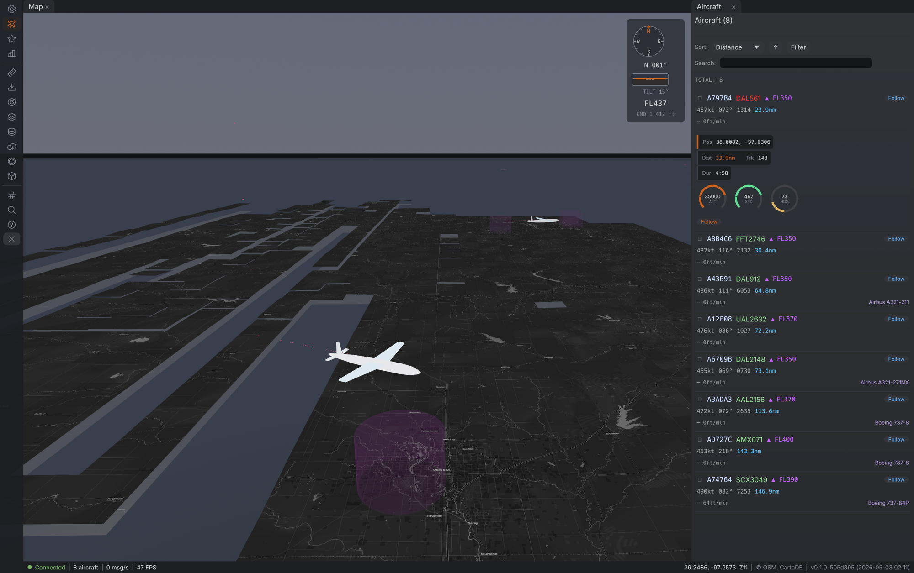

# AirJedi

A real-time aircraft tracker built with the [Bevy](https://bevyengine.org/) game engine. AirJedi renders live ADS-B aircraft positions on an interactive slippy map with support for both 2D and 3D views.



## Features

- **Live ADS-B tracking** - Connects to an SBS1/Beast feed and displays aircraft positions in real time
- **2D and 3D map views** - Seamless transitions between a flat slippy map and a perspective 3D view with atmosphere, sky, and terrain
- **Multiple basemap styles** - OpenStreetMap, ESRI satellite imagery, and more
- **Aircraft details** - Altitude-based coloring, flight trails, prediction lines, and detailed info panels
- **Aviation data overlays** - Airports, navaids, runways, and airspace boundaries
- **Day/night cycle** - Realistic sun and moon positioning based on time and location
- **Weather indicators** - METAR-based weather display
- **Flight recording** - Record and play back flight data
- **Dockable UI** - Tabbed panels for aircraft list, stats, debug info, and settings

## Requirements

- Rust (stable toolchain)
- macOS, Linux, or Windows
- An ADS-B data source (e.g., [readsb](https://github.com/wiedehopf/readsb) with SBS1 output)

## Building and Running

```bash
# Debug build (faster compile, slower runtime)
cargo build
cargo run

# Release build (slower compile, faster runtime)
cargo build --release
cargo run --release
```

## macOS App Bundle

```bash
cd macos
make app    # Build AirJedi.app
make run    # Build and launch
```

## Configuration

Settings are persisted to a TOML config file and can be changed through the in-app settings panel. This includes basemap style, default map center, zoom level, and ADS-B connection settings.

## License

All rights reserved.
